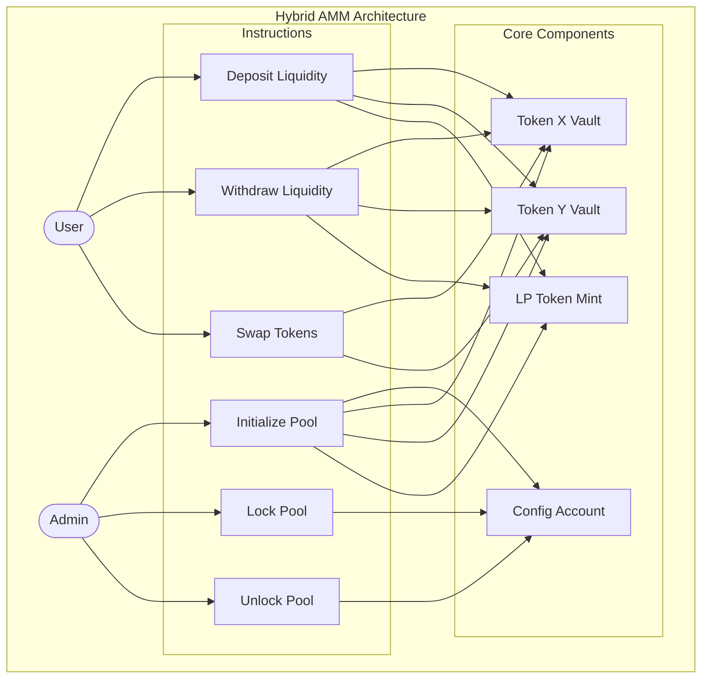
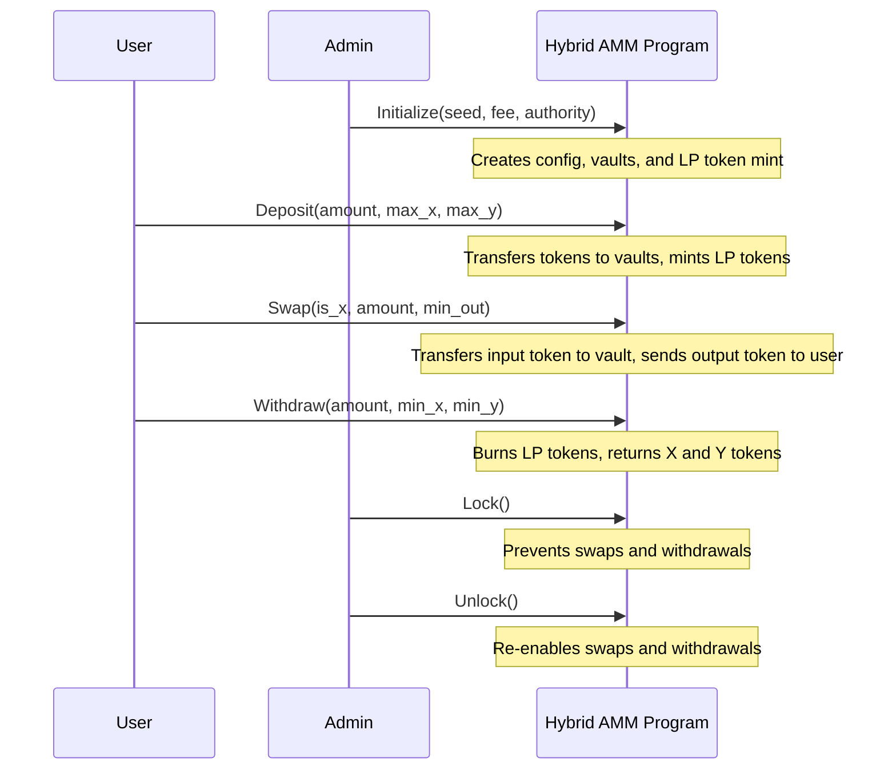
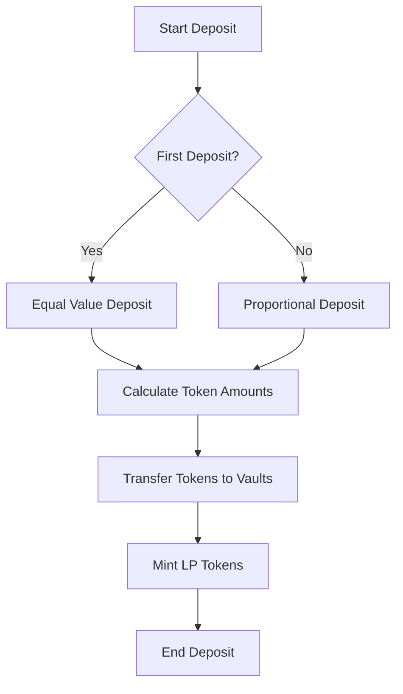
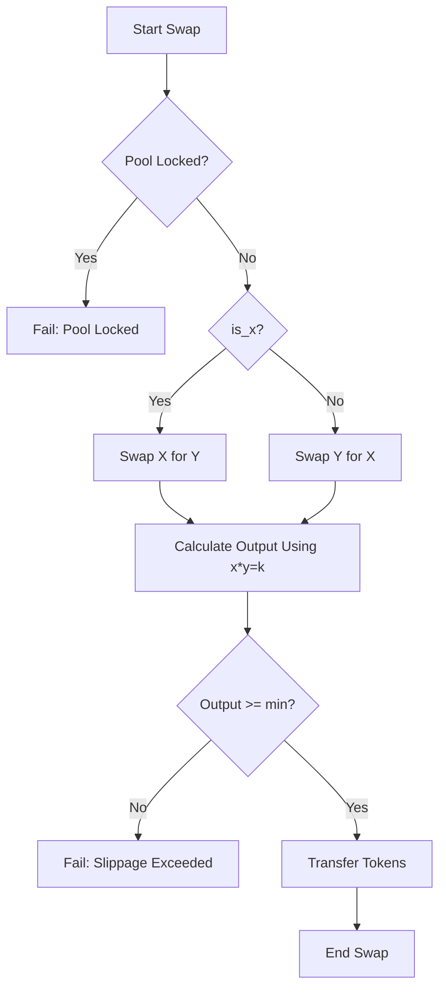
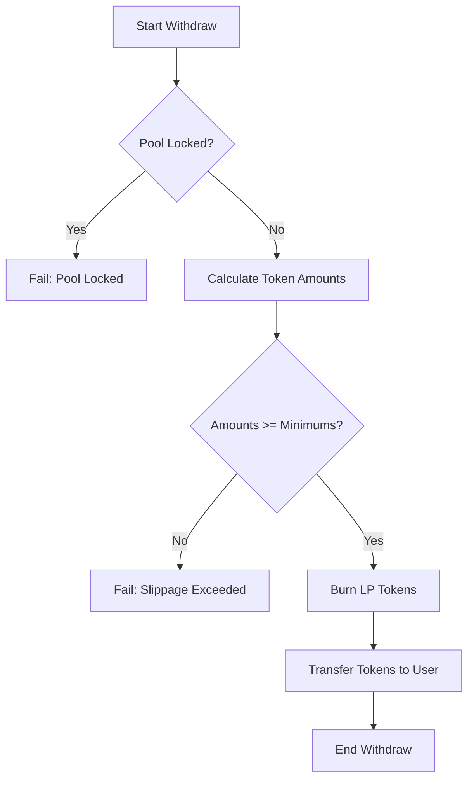
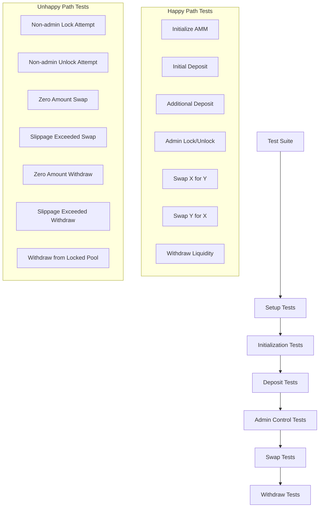

# Hybrid AMM (Automated Market Maker)

A decentralized exchange protocol built on Solana using the Anchor framework. This AMM implements a constant product market maker algorithm (x * y = k) for token swaps with minimal price slippage.

## Table of Contents

- [Overview](#overview)
- [Architecture](#architecture)
- [Key Accounts](#key-accounts)
- [Key Features](#key-features)
- [Program Instructions](#program-instructions)
- [Getting Started](#getting-started)
- [Testing](#testing)
- [Frontend](#frontend)

## Overview

This Hybrid AMM is a Solana-based decentralized exchange that allows users to:
- Create liquidity pools for token pairs
- Add liquidity to earn fees
- Swap between tokens with minimal slippage
- Withdraw liquidity as needed

The protocol uses a constant product formula (x * y = k) to determine exchange rates, ensuring that the product of the quantities of the two tokens in the pool remains constant after each trade, minus fees.

## Architecture

The Hybrid AMM consists of several key components:



### Key Accounts

1. **Config Account**: Stores pool parameters, including:
   - Token X and Y mint addresses
   - Fee percentage
   - Admin authority
   - Lock status
   - PDAs bump seeds

2. **Token Vaults**: Secure storage for pool tokens:
   - Vault X: Holds Token X reserves
   - Vault Y: Holds Token Y reserves

3. **LP Token Mint**: Represents user's share in the liquidity pool

## Key Features

1. **Constant Product Formula**
   - Uses x * y = k formula for price determination
   - Ensures price stability with larger liquidity pools

2. **Fee Mechanism**
   - Configurable fee percentage (default: 0.3%)
   - Fees accrue to liquidity providers

3. **Slippage Protection**
   - Users can set minimum output amounts for swaps
   - Users can set maximum input amounts for deposits

4. **Pool Security**
   - Admin-controlled pool locking mechanism
   - Authority checks for administrative actions

5. **Event Emission**
   - Detailed events for all operations for off-chain tracking

## Program Instructions

The Hybrid AMM program provides the following instructions:

- [Initialize](#initialize) - Create a new liquidity pool
- [Deposit](#deposit) - Add liquidity to the pool
- [Swap](#swap) - Exchange tokens in the pool
- [Withdraw](#withdraw) - Remove liquidity from the pool
- [Lock](#lockunlock) - Lock the pool (admin only)
- [Unlock](#lockunlock) - Unlock the pool (admin only)



### Initialize

Creates a new liquidity pool for a token pair.

**Parameters:**
- `seed`: Unique identifier for the pool
- `fee`: Fee percentage (in basis points, e.g., 30 = 0.3%)
- `authority`: Optional custom admin authority

**Process:**
1. Creates config account with pool parameters
2. Creates token vaults for X and Y tokens
3. Creates LP token mint
4. Sets admin authority

### Deposit

Adds liquidity to the pool.

**Parameters:**
- `amount`: Desired LP token amount
- `max_x`: Maximum Token X to deposit
- `max_y`: Maximum Token Y to deposit

**Process:**


1. Calculates required amounts of Token X and Y
2. Ensures amounts are within user's specified maximums
3. Transfers tokens to respective vaults
4. Mints LP tokens to user representing their share

### Swap

Exchanges one token for another.

**Parameters:**
- `is_x`: Direction of swap (true = X→Y, false = Y→X)
- `amount`: Amount of input token
- `min`: Minimum amount of output token expected

**Process:**


1. Verifies pool is not locked
2. Calculates output amount using constant product formula
3. Ensures output meets minimum requirement (slippage protection)
4. Transfers input token from user to vault
5. Transfers output token from vault to user

### Withdraw

Removes liquidity from the pool.

**Parameters:**
- `amount`: LP token amount to burn
- `min_x`: Minimum Token X expected
- `min_y`: Minimum Token Y expected

**Process:**


1. Verifies pool is not locked
2. Calculates proportional amounts of Token X and Y
3. Ensures amounts meet minimum requirements
4. Burns LP tokens
5. Transfers tokens from vaults to user

### Lock/Unlock

Controls the operational status of the pool.

**Process:**
1. Verifies caller is the admin authority
2. Updates the locked status in the config account

## Getting Started

### Prerequisites

- Rust 1.68.0 or later
- Solana CLI 1.16.0 or later
- Anchor Framework 0.29.0 or later
- Node.js 16.0.0 or later

### Installation

1. Clone the repository:
```bash
git clone https://github.com/yourusername/hybrid_amm.git
cd hybrid_amm
```

2. Install dependencies:
```bash
npm install
```

3. Build the program:
```bash
anchor build
```

4. Deploy to a local validator:
```bash
solana-test-validator
anchor deploy
```

## Testing

The project includes comprehensive tests covering both happy and unhappy paths:

### Test Structure



Run the tests with:
```bash
anchor test
```

## Frontend

The project includes a simple React-based frontend for interacting with the Hybrid AMM program.

### Features

- Connect to Solana wallets (Phantom, Solflare)
- View pool information
- Swap tokens
- Deposit and withdraw liquidity
- Admin controls for locking/unlocking the pool

### Getting Started with the Frontend

1. Navigate to the frontend directory:
```bash
cd frontend
```

2. Run the setup script:
```bash
./setup.sh
```

3. If you encounter any issues, run the troubleshooting script:
```bash
./fix-frontend.sh
```

4. Start the development server:

```bash
npm start
```

5. Open [http://localhost:3000](http://localhost:3000) to view the app in your browser.

#### Troubleshooting Frontend Setup

If you encounter issues with the frontend setup, use the troubleshooting script:

```bash
./fix-frontend.sh
```

This script will automatically:
- Check for missing dependencies and install them
- Verify react-app-rewired is installed correctly
- Install required polyfills
- Create or verify config-overrides.js
- Update package.json scripts if needed


For more details, see the Frontend README in the frontend directory.
